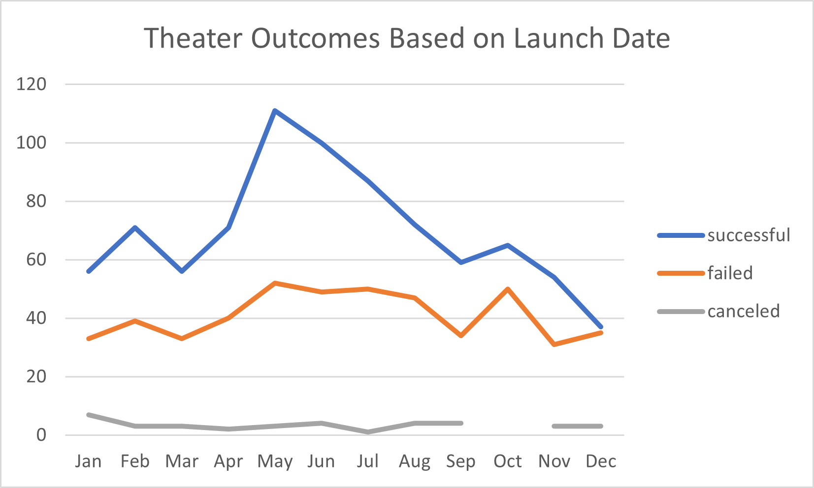
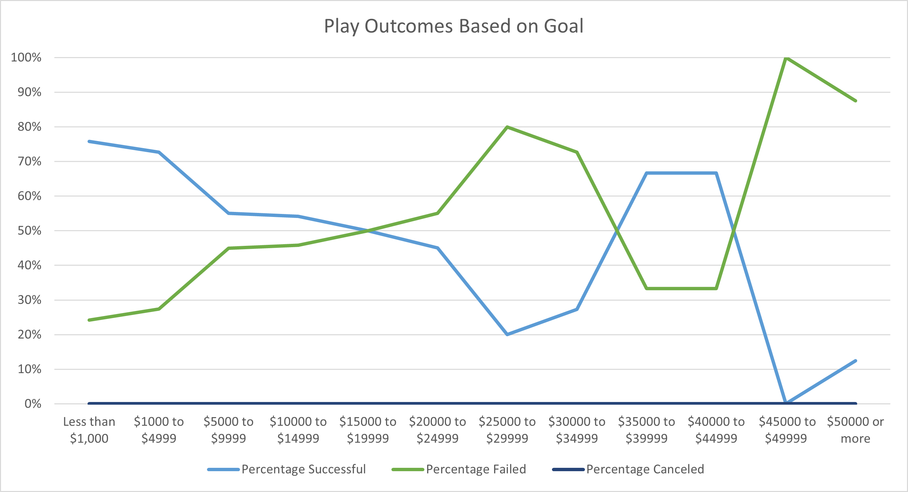
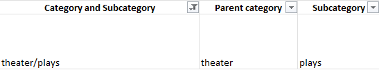

# Kickstarting with Excel

## Overview of Project
This analysis found that Kickstarter projects focused on the theater may improve their chances of success by timing their launches close to mid-year and by 
keeping their fundraising goals relatively modest in most cases.   

### Purpose
In order to provide fundraising insights for theater entrepreneurs, we analyzed fundraising campaign outcomes for certain Kickstarter projects based on 
variables including launch dates and fundraising goal amounts. Using the results of this analysis, Kickstarter project leaders can budget more realistically and 
choose the optimal timing for project launch.

## Analysis and Challenges
Starting with data for nearly 40,000 Kickstarter projects in various categories, we looked at success rates for 1,369 theater projects based on their month of 
launch and for 1,047 plays based on the amount of money their creators sought to raise. Our analysis excluded 24 theater projects, including 19 plays, whose 
Kickstarter campaigns were live at the time of data compilation. The earliest completed theater campaign in our dataset launched in July 2010, while the latest 
began in March 2017.

Below we chart how many theater projects succeeded, failed or were canceled (Y axis) based on the month in which fundraising began (X axis). In the second chart, we show the percentages of Kickstarter plays that succeeded, failed or were canceled (Y axis), bucketed by the amount of money they had as their goal (X axis).

### Analysis of Outcomes Based on Launch Date
More theater Kickstarters succeed in May than in any other month, on both an absolute and relative basis. Nearly 67% of projects launched in 
May achieved their fundraising goals. After May, success rates plunge to less than 50% by year-end. Fundraising success starts building again in January. On an 
absolute basis, failed theater campaigns also peak in May, making this the most active month for Kickstarter theater campaign launches regardless of outcome. 

### Analysis of Outcomes Based on Goals
Kickstarter campaigns for plays have the highest chance of success if they set the fundraising bar very low. More than three-quarters of plays targeting less than 
$1,000 achieved their goal. Success rates steadily fall as the goal sizes increase, and the percentage of failed campaigns actually starts to exceed that of successful
campaigns at around the $15,000 goal mark. Successes do not start again to exceed failures on a relative basis until the $35,000 goal threshold. There we see another 
sweet spot; about two-thirds of campaigns that target $35,000 to $45,000 managed to achieve their goals. After that, however, success is much harder to come by. 
The percentage of successful campaigns nosedives for those seeking $45,000 or more.

### Challenges and Difficulties Encountered
The original data set presented a few challenges that required some cleanup. For example, we had to convert dates from Unix timestamps to a more reader-friendly format using 
the following formula:

`=(((J2/60)/60)/24)+DATE(1970,1,1)`

Another issue arose from how the original data set combined the categories and subcategories for each project into a single string in Excel (e.g. "theater/plays"). 
Splitting these into two variables, each in its own column, made it much easier to analyze the data. We accomplished this by copying the data from the "Category
and Subcategory" column into another column and then using the Convert Text to Columns Wizard, selecting the backslash as the delimiter for splitting the string. 
This resulted in much more usable categories and subcategories:

## Results
More Kickstarter theater projects launch in May than in any other month, and they are more likely to be successful than projects started in any other month.
This suggests that project leaders should get their campaigns ready early in the year, in order to target a May launch. Alternatively, they may do well to beat
the rush by getting their campaigns started earlier, such as in April when success rates tend to already be on the rise.

As with most projects, it seems that theater entrepreneurs should think critically about their budgets, as the Kickstarter process seems to only rarely reward
campaigns with large goals. If a play project is seeking more than $15,000, its creators should make sure that all other factors are working in their favor, 
such as campaign timing.

Narrowing our kickstarter data down to only plays leads to very small sample sizes, particularly when it comes to projects with higher goals. In the play
category, for example, only 26 projects targeted $35,000 or more, compared to 186 projects in the sub-$1,000 category alone. We should take the 
$35,000-to-$45,000 "sweet spot" mentioned above with a grain of salt, so to speak, as only nine total play projects had goals in that range. Larger sample sizes 
could allow us to slice and dice the data further, such as by showing the extent to which fundraising amounts and timing work together to impact success rates.

Further analysis could show theater outcomes based on goals and play outcomes based on launch date, mirroring the charts above. It may also be beneficial for 
theater-focused project leaders to see how their category fares relative to other types of projects, such as those in the film & video and music categories. 
Examining trends in number of backers for projects by date and success rates could also provide useful insights.
